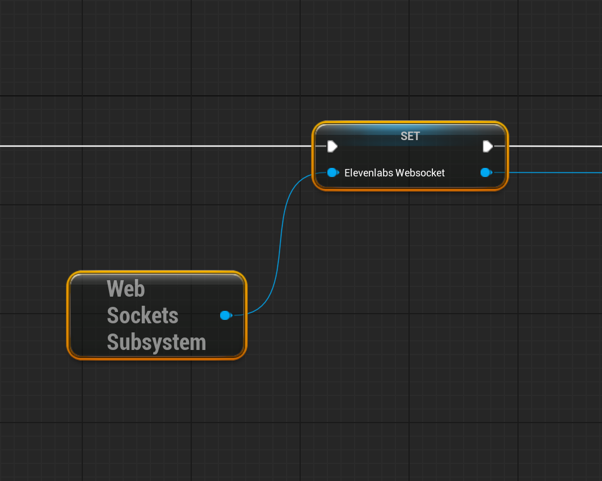
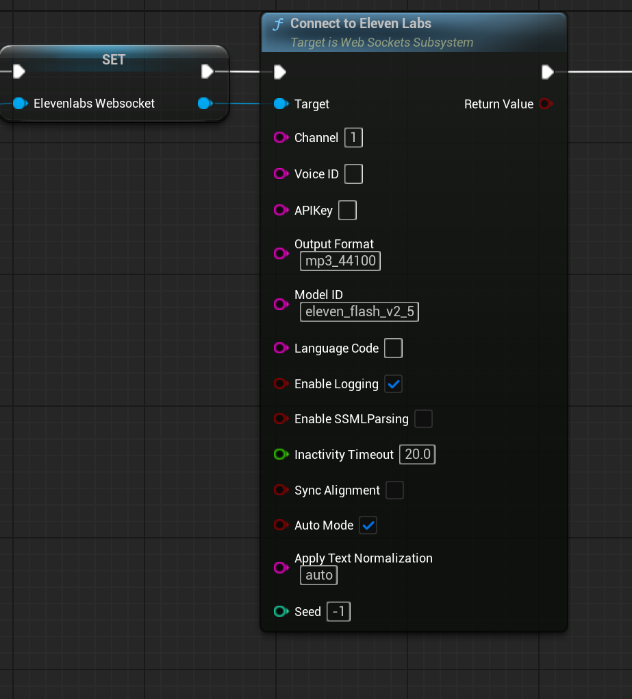
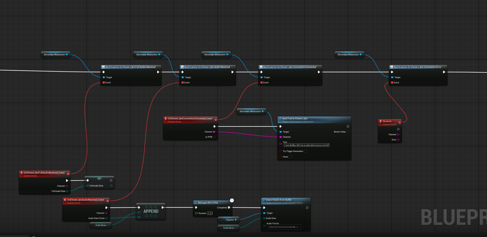
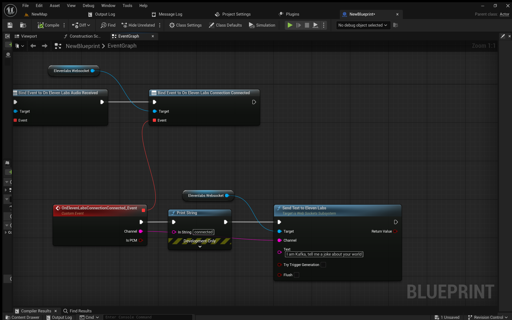
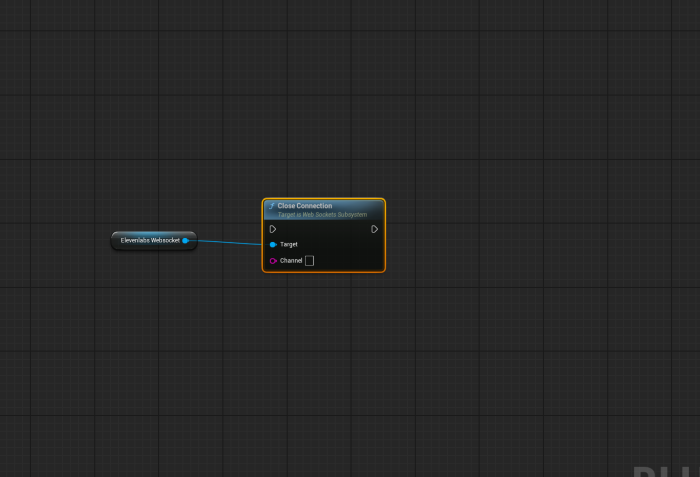
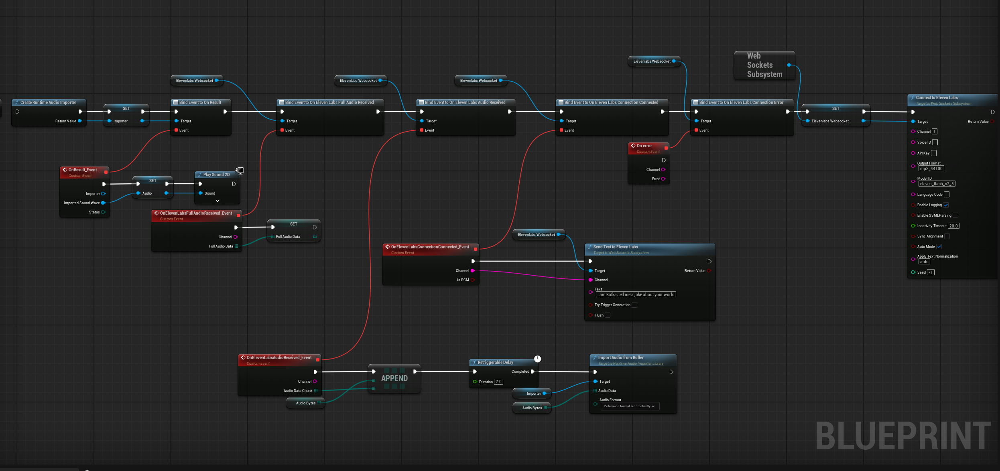

# Table of Contents

* [Usikulabs Unreal Engine Plugin for ElevenLabs Text-to-Speech](#usikulabs-unreal-engine-plugin-for-elevenlabs-text-to-speech)
    * [Overview](#overview)
    * [Features](#features)
    * [Technical Documentation](#technical-documentation)
        * [Module: `Usikulabs`](#module-usikulabs)
        * [Subsystem: `WebSocketsSubsystem`](#subsystem-websocketssubsystem)
    * [Blueprint Usage Guide](#blueprint-usage-guide)
    * [Importing Raw Audio Bytes with Runtime Audio Importer (RAI)](#importing-raw-audio-bytes-with-runtime-audio-importer-rai)
        * [Why use Runtime Audio Importer?](#why-use-runtime-audio-importer)
        * [How to use RAI with Usikulabs:](#how-to-use-rai-with-usikulabs)
    * [Runtime Audio Importer (RAI) License](#runtime-audio-importer-rai-license)

# Usikulabs Unreal Engine Plugin for ElevenLabs Text-to-Speech

## Overview

The **Usikulabs** plugin for Unreal Engine is designed to seamlessly integrate ElevenLabs' powerful Text-to-Speech (TTS) capabilities into your projects. This plugin leverages WebSockets to establish a real-time streaming connection with the ElevenLabs API, allowing you to generate and receive audio directly within your Unreal Engine environment.  It offers a user-friendly Blueprint interface, making it easy to implement dynamic and interactive voice experiences in your games, applications, or virtual productions.

## Features

* **Real-time Streaming TTS:** Connect to ElevenLabs via WebSockets for low-latency, streaming audio generation.
* **Blueprint Support:** Fully accessible and controllable through Unreal Engine Blueprints for intuitive integration.
* **ElevenLabs API Integration:** Simplifies the connection and communication with the ElevenLabs API, handling WebSocket management and message formatting.
* **Configurable Voice Parameters:**  Allows you to customize voice settings like Voice ID, Model ID, Stability, Similarity Boost, Style, Speed, and more, directly from Blueprints.
* **Multiple Output Formats:** Supports various audio output formats (currently defaults to MP3 but can be configured via parameters).
* **Event-Driven Audio Handling:** Provides events for connection status (connected, closed, error), audio chunk reception, and full audio reception, enabling flexible audio processing in Blueprints.
* **Accumulated Audio Data:**  Collects and provides the full generated audio data once the text-to-speech process is finalized.
* **Comprehensive Parameter Control:** Exposes a wide range of ElevenLabs API parameters for fine-tuning voice generation.
* **Logging and Error Handling:** Includes logging for connection status and errors to aid in debugging.
* **Runtime Audio Import Integration:** Seamlessly integrates with the **[Runtime Audio Importer (RAI)](https://github.com/Georgy-Treshchev/RuntimeAudioImporter)** plugin to directly import and utilize the raw audio byte data received from ElevenLabs as playable `USoundWave` assets at runtime. **Runtime Audio Importer is an open-source plugin available on GitHub.**

## Technical Documentation

### Module: `Usikulabs`

This module is the core of the plugin, containing the `FUsikulabsModule` class which handles the plugin's lifecycle within Unreal Engine.

* **`FUsikulabsModule` Class:**
    * **`StartupModule()`:**  Called when the module is loaded. Currently, it's empty but can be used for module initialization logic in the future.
    * **`ShutdownModule()`:** Called when the module is unloaded.  Used for cleaning up resources if needed.

### Subsystem: `WebSocketsSubsystem`

The `UWebSocketsSubsystem` is a Game Instance Subsystem responsible for managing WebSocket connections to ElevenLabs and providing Blueprint callable functions for TTS operations.

* **Class: `UWebSocketsSubsystem` (UGameInstanceSubsystem)**
    * **`Initialize(FSubsystemCollectionBase& Collection)`:**
        * Overrides the base class `Initialize` function.
        * Ensures that the "WebSockets" and "JsonUtilities" modules are loaded. These are dependencies for WebSocket functionality and JSON serialization/deserialization.
    * **`Deinitialize()`:**
        * Overrides the base class `Deinitialize` function.
        * Clears all internal maps that store WebSocket connections, API keys, voice settings, and accumulated audio data. This ensures a clean state when the subsystem is deinitialized.
    * **`ConnectToElevenLabs(const FString& Channel, const FString& VoiceID, const FString& APIKey, const FString& OutputFormat = TEXT("mp3_44100"), const FString& ModelID = TEXT("eleven_monolingual_v1"), const FString& LanguageCode = TEXT(""), bool EnableLogging = false, bool EnableSSMLParsing = false, double InactivityTimeout = 20.0, bool SyncAlignment = false, bool AutoMode = false, const FString& ApplyTextNormalization = TEXT("auto"), int32 Seed = -1)`:**
        * **Blueprint Callable:** Yes
        * **Category:** "Usikulabs"
        * **Description:** Establishes a WebSocket connection to the ElevenLabs streaming TTS API.
        * **Parameters:**
            * **`Channel` (FString):** A unique identifier for this connection. Used to manage multiple concurrent connections.
            * **`VoiceID` (FString):** The ID of the ElevenLabs voice to use.
            * **`APIKey` (FString):** Your ElevenLabs API key for authentication.
            * **`OutputFormat` (FString, Default: "mp3_44100"):** The desired audio output format. Currently, the plugin is primarily designed for MP3.
            * **`ModelID` (FString, Default: "eleven_monolingual_v1"):** The ElevenLabs model ID to use for TTS.
            * **`LanguageCode` (FString, Default: ""):**  The language code for the text (e.g., "en", "es").
            * **`EnableLogging` (bool, Default: false):** Enables detailed logging for debugging purposes.
            * **`EnableSSMLParsing` (bool, Default: false):** Enables SSML (Speech Synthesis Markup Language) parsing in the input text.
            * **`InactivityTimeout` (double, Default: 20.0):**  Sets the inactivity timeout for the WebSocket connection.
            * **`SyncAlignment` (bool, Default: false):** Enables synchronization alignment (if supported by ElevenLabs).
            * **`AutoMode` (bool, Default: false):** Enables auto mode (if supported by ElevenLabs).
            * **`ApplyTextNormalization` (FString, Default: "auto"):**  Controls text normalization ("auto", "none", or "forced").
            * **`Seed` (int32, Default: -1):** Sets a seed for reproducibility (-1 for random seed).
        * **Returns:** `bool` - `true` if connection attempt started successfully, `false` if a connection with the same channel already exists.
    * **`CloseConnection(const FString& Channel)`:**
        * **Blueprint Callable:** Yes
        * **Category:** "Usikulabs"
        * **Description:** Closes the WebSocket connection associated with the given `Channel`.
        * **Parameters:**
            * **`Channel` (FString):** The channel identifier of the connection to close.
    * **`SendTextToElevenLabs(const FString& Channel, const FString& Text, bool TryTriggerGeneration = false, bool Flush = false)`:**
        * **Blueprint Callable:** Yes
        * **Category:** "Usikulabs"
        * **Description:** Sends text to ElevenLabs for speech synthesis over the WebSocket connection.
        * **Parameters:**
            * **`Channel` (FString):** The channel identifier of the connection to use.
            * **`Text` (FString):** The text to be synthesized.
            * **`TryTriggerGeneration` (bool, Default: false):**  Indicates if ElevenLabs should attempt to trigger generation immediately (API specific).
            * **`Flush` (bool, Default: false):** Indicates if the text should be flushed immediately (API specific).
        * **Returns:** `bool` - `true` if the message was sent successfully, `false` if the connection doesn't exist or is not connected.
    * **Events (Delegates):**
        * **`FOnElevenLabsConnectionConnected`:**
            * **Broadcast Delegate:** Yes
            * **Parameters:**
                * **`Channel` (FString):** The channel identifier of the connected connection.
                * **`IsPCM` (bool):**  Indicates if the connection is using PCM format (currently always `true` in the delegate definition, even if default is MP3, as binary data is handled). *Note: This might need clarification if actual PCM output is intended in future versions, currently it's used to indicate binary audio data stream.*
            * **Description:** Broadcast when a WebSocket connection to ElevenLabs is successfully established.
        * **`FOnElevenLabsConnectionClosed`:**
            * **Broadcast Delegate:** Yes
            * **Parameters:**
                * **`Channel` (FString):** The channel identifier of the closed connection.
                * **`Reason` (FString):**  The reason for the connection closure (if provided by the WebSocket implementation).
            * **Description:** Broadcast when a WebSocket connection to ElevenLabs is closed.
        * **`FOnElevenLabsConnectionError`:**
            * **Broadcast Delegate:** Yes
            * **Parameters:**
                * **`Channel` (FString):** The channel identifier of the connection that encountered an error.
                * **`Error` (FString):**  The error message associated with the connection error.
            * **Description:** Broadcast when a WebSocket connection to ElevenLabs encounters an error.
        * **`FOnElevenLabsAudioReceived`:**
            * **Broadcast Delegate:** Yes
            * **Parameters:**
                * **`Channel` (FString):** The channel identifier of the connection that received audio.
                * **`AudioDataChunk` (TArray<uint8>):** A chunk of audio data received from ElevenLabs. The format of this data depends on the `OutputFormat` specified during connection (currently defaults to MP3 binary data).
            * **Description:** Broadcast when a chunk of audio data is received from ElevenLabs over the WebSocket.
        * **`FOnElevenLabsFullAudioReceived`:**
            * **Broadcast Delegate:** Yes
            * **Parameters:**
                * **`Channel` (FString):** The channel identifier of the connection for which full audio is received.
                * **`FullAudioData` (TArray<uint8>):** The complete, accumulated audio data for the generated speech.
            * **Description:** Broadcast when the full audio generation is complete and all accumulated audio chunks are provided as a single `TArray<uint8>`. This event is triggered when the ElevenLabs API signals the end of the stream (typically with an `"isFinal":true` message).

    * **Private Functions:**
        * `OnConnectionConnectedInternal(const FString& Channel)`
        * `OnConnectionErrorInternal(const FString& Channel, const FString& Error)`
        * `OnConnectionClosedInternal(const FString& Channel, const FString& Reason)`
        * `OnAudioReceivedInternal(const FString& Channel, const FString& Base64Audio)`
        * `OnElevenLabsMessageReceived(const FString& Channel, const FString& MessageString)`
        * `SendElevenLabsInitializationMessage(const FString& Channel)`

    * **Internal Data Members (Maps):**
        * `WebSocketChannelMap`
        * `APIKeyMap`
        * `ModelIDMap`, `LanguageCodeMap`, `EnableLoggingMap`, `EnableSSMLParsingMap`, `InactivityTimeoutMap`, `SyncAlignmentMap`, `AutoModeMap`, `ApplyTextNormalizationMap`, `SeedMap`
        * `StabilityMap`, `SimilarityBoostMap`, `StyleMap`, `UseSpeakerBoostMap`, `SpeedMap`, `ChunkLengthScheduleMap`
        * `AccumulatedAudioDataMap`

## Blueprint Usage Guide

Follow these steps to use the Usikulabs plugin in your Unreal Engine Blueprints:

1. **Enable the Plugin:** Ensure the "Usikulabs" plugin is enabled in your project's Plugin settings. Also, make sure the "WebSockets" and "JsonUtilities" plugins are enabled as they are dependencies.

2. **Get the WebSockets Subsystem:** Get a reference to the `WebSocketsSubsystem` using the "Get Game Instance Subsystem" node in your Blueprint.

   

3. **Connect to ElevenLabs:** Use the "Connect To Eleven Labs" node from the `WebSocketsSubsystem` reference.

   

4. **Bind Events:**  Bind to the events provided by the `WebSocketsSubsystem` to handle connection status and audio data.

   

5. **Send Text for TTS:**  Use the "Send Text To Eleven Labs" node to send text to ElevenLabs for speech synthesis.

   

6. **Close Connection (Optional):**  Use the "Close Connection" node when you no longer need the connection.

   

### Importing Raw Audio Bytes with Runtime Audio Importer (RAI)

The Usikulabs plugin now supports direct import of raw audio byte data received from ElevenLabs using the **[Runtime Audio Importer (RAI)](https://github.com/gtreshchev/RuntimeAudioImporter.git)** plugin. This integration allows you to seamlessly convert the byte arrays provided by the `OnElevenLabsAudioReceived` and `OnElevenLabsFullAudioReceived` events into playable `USoundWave` assets within your Unreal Engine project, all at runtime. **Runtime Audio Importer is an open-source plugin available on GitHub.**

**Why use Runtime Audio Importer?**

* **Direct Audio Data Handling:**  Directly utilize audio data received in memory.
* **Dynamic Audio Creation:**  Create `USoundWave` assets on-the-fly.
* **Simplified Workflow:** Streamlines the process of getting audio from ElevenLabs into a playable format.

**How to use RAI with Usikulabs:**

1. **Utilize `OnElevenLabsAudioReceived` Event:** Access `AudioDataChunk` (for `OnElevenLabsAudioReceived`) as `TArray<uint8>` in your Blueprint event.

2. **Use RAI Blueprint Nodes (or C++ functions) to Import Audio:** Use RAI nodes within the Event Graph of your bound event to import the `AudioDataChunk`.

   

3. **Play the `USoundWave` Asset:** Use standard Unreal Engine audio nodes to play the `USoundWave` asset created by RAI.

### Runtime Audio Importer (RAI) License

https://github.com/gtreshchev/RuntimeAudioImporter.git
